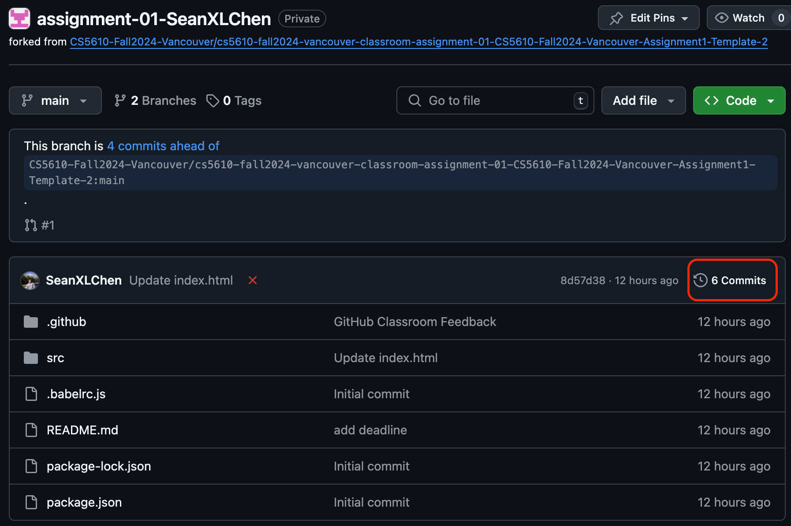
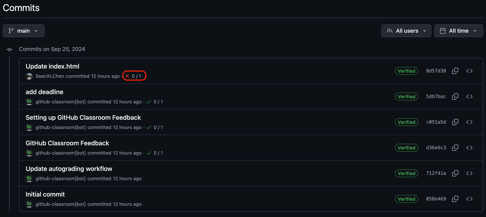
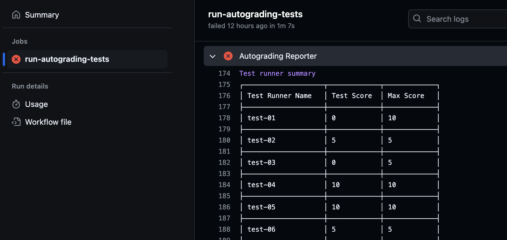

# Assignment 3: Backend Developer Co-op @ TikTok Vancouver 🌟

**Welcome aboard! 🎉** You’ve just been hired as a Backend Developer Co-op in Vancouver’s brand-new TikTok office. As the Vancouver team is settling in, they’ve given you an exciting task: **building an internal hours-tracking system for employees.** This system will help team members log their working hours and track their productivity.

Here’s your mission (should you choose to accept it 😉):

### Project Overview 🚀

Your goal is to create a backend API for TikTok’s new Employee Hours Tracking System. This API will enable team members to check in, log their hours, update their info, and even remove their profiles if necessary. To make this easier, your manager provided a set of detailed API routes you’ll need to implement in a separate file [ROUTES.md](./ROUTES.md)

Your team has also had a express server seted under `server/`, and you are tasked to implement the Route logics on this [server implementation file](./server/serverImplementation.js) 

Use `npm start` you can already run your starting server, feel free to change your server port.

### Instructions 📜

1. **API Endpoints**: 
Implement all routes described in [ROUTES.md](./ROUTES.md). This file has everything you need to get started—detailed descriptions, request parameters, responses, and example outputs for each route.

2. **Route Implementations**: 
The basic server setup is already created for you under `server/`. Your task is to code in the provided server logic file [serverImplementation.js](./server/serverImplementation.js).

3. **Server Setup**:
- Your API should be built using Node.js with Express.
- All routes must follow RESTful conventions, and CORS should be configured to allow requests from localhost.

4. **Running the Server**: 
Use `npm start` to launch the server. Feel free to adjust the port if needed.

5. **Data Handling**:
- Use in-memory storage to keep things simple (no database required). 
- Each new user should have an auto-incremented ID for easy identification (1-indexed).

6. **Error Handling**: Return appropriate status codes and error messages if a request fails due to invalid data, or if a user doesn’t exist.

7. **Testing**: Make sure each route works as expected with different inputs and edge cases. Jest is recommended for easy testing.

### Grading Rubrics (100 Points)
Each route is worth a portion of your grade as follows:

- **Route 1**: Testing Route (GET /ping) - 10 Points
- **Route 2**: Get All Users (GET /users) - 10 Points
- **Route 3**: Get User by ID (GET /users/:id) - 10 Points
- **Route 4**: Add a New User (POST /users) - 10 Points
- **Route 5**: Update User by ID (PUT /users/:id) - 10 Points
- **Route 6**: Update Hours Worked for a User (PATCH /users/:id) - 10 Points
- **Route 7**: Get Users with Filtered Hours Worked (GET /users-above?hours={value}) - 20 Points
- **Route 8**: Delete User by ID (DELETE /users/:id) - 10 Points
- **Route 9**: Delete All Users (DELETE /users) - 10 Points

### Automated Testing

Your project will be automatically tested against the rubric using a set of predefined tests. These tests will check the structure and content of your HTML and CSS files, so ensure your project strictly follows the guidelines provided. :warning: :warning: :warning: Any modification to files outside the `server/` folder could result in failed tests or disqualification of your submission. :warning: :warning: :warning:

#### Viewing Your Autograder Score

To access the results of the autograder for your commits, follow these steps:

1. After pushing your changes to GitHub, click on the commit message to view the details of the specific commit.
  
2. On the commit details page, find the Actions status and click on it to view the results of the autograder task.
  
3. Review the detailed report of your autograded score. This report will show which tests passed or failed, and how many points were awarded based on the rubric.
  